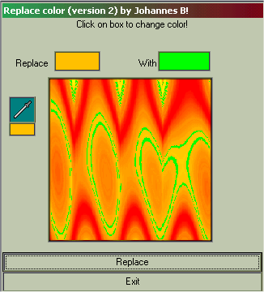



## Replace color in a picture\! \(uppdated\)

### Description

Select a color and a color to replace with and the program replaces all pixles with the selected color! (uppdated! Now using API calls that is much faster)
 
### More Info
 

             |
---                |---
**Submitted On**   |2001-01-20 09:41:38
**By**             |[Johannes B](https://github.com/Planet-Source-Code/PSCIndex/blob/master/ByAuthor/johannes-b.md)
**Level**          |Beginner
**User Rating**    |4.1 (29 globes from 7 users)
**Compatibility**  |VB 5\.0, VB 6\.0
**Category**       |[Graphics](https://github.com/Planet-Source-Code/PSCIndex/blob/master/ByCategory/graphics__1-46.md)
**World**          |[Visual Basic](https://github.com/Planet-Source-Code/PSCIndex/blob/master/ByWorld/visual-basic.md)
**Archive File**   |[CODE\_UPLOAD140421222001\.zip](https://github.com/Planet-Source-Code/johannes-b-replace-color-in-a-picture-uppdated__1-13222/archive/master.zip)

### API Declarations

Just a API call!

